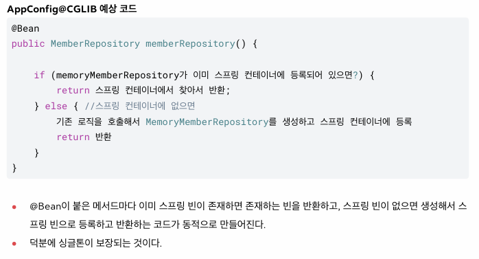

# Spring-Practice 🌱

김영한 스프링 강의 - 기본편 실습 저장소입니다.  
Spring Core 원리를 학습하며 작성한 예제 코드를 관리합니다.

---

## 📖 목차
- [소개](#-소개)
- [기술 스택](#-기술-스택)
- [프로젝트 구조](#-프로젝트-구조)
- [실행 방법](#-실행-방법)
- [학습 내용](#-학습-내용)
- [학습 기록](#-학습-기록)
---

## 🌟 소개
스프링의 핵심 원리(스프링 컨테이너, 의존관계 주입, 싱글톤, 컴포넌트 스캔 등)를  
예제 코드를 통해 연습하는 프로젝트입니다.

---

## 🛠 기술 스택
- **Java 17**
- **Spring Framework**
- **Gradle**
- **IntelliJ IDEA**

---

## 📂 프로젝트 구조
```bash
src
 ├─ main
 │   └─ java
 │       └─ hello.core
 │            ├─ AppConfig.java
 │            ├─ member
 │            ├─ order
 │            └─ discount
 └─ test
     └─ java
         └─ hello.core
```

## 🚀 실행 방법
아직까진 main에서 실행


---

## 📝 학습 기록
1일차 (2025-09-12)

 - https://start.spring.io/ 를 통해 프로젝트 생성

 - 아직 스프링은 사용하지 않고, 기본 Java 코드로만 연습

 - 연습 과정에서 SOLID 원칙 공부

---
2일차 (2025-09-13)

 - AppConfig를 통해 DIP 원칙 준수
 - AppConfig를 통해관심사 분리
 -  AppConfig는 공연 기획자라고 생각하면 된다.
 -  각 구체 클래스를 선택하고 할당해줌.

 -  구체 파일(Impl)이 이전에는 MemoryMemberRepository를 직접 의존
 -  AppConfig로 변경 후에는 memberRepository 인터페이스만 의존 (DIP)
 -  이제 구체 파일은 Memory를 의존하는지, JDBC를 의존하는지, 다른걸 의존하는지 모름 > 실행에만 집중함

MemberServiceImpl 예시

기존 코드

    private final MemberRepository memberRepository = new MemoryMemberRepository();


변경된 코드

    기존 코드 주석처리

    //private final MemberRepository memberRepository = new MemoryMemberRepository();

    AppConfig 생성하면서 위의 코드 주석처리
    이후 생성자 만듦

    private final MemberRepository memberRepository;

    public MemberServiceImpl(MemberRepository memberRepository) {
        this.memberRepository = memberRepository;
    }

**스프링 전환**

    AppConfig에
    
    @Configuration
    
    각 메서드에 @Bean 추가 > 스프링 컨테이너에 등록됨
.

    MemberApp에
    ApplicationContext applicationContext = new AnnotationConfigApplicationContext(AppConfig.class);
    //@Bean을 관리해줌
    MemberService memberService = applicationContext.getBean("memberService", MemberService.class);
    
    OrderApp에
    ApplicationContext applicationContext = new AnnotationConfigApplicationContext(AppConfig.class);
    MemberService memberService = applicationContext.getBean("memberService",MemberService.class);
    OrderService orderService = applicationContext.getBean("orderService", OrderService.class);
    
    추가
    
    ApplicationContext가 Bean을 관리해줌

---
3일차 (2025-09-14)

ApplicationContext...Test.java

Bean을 조회하는 여러가지 방법

>ApplicationContextBasicFindTest - 기본적인 빈 조회 방법
> 
>ApplicationContextInfoTest - 모든 빈 조회
> 
>ApplicationContextSameBeanFindTest - 동일한 타입 조회시 오류 상황
> 
>ApplicationContextExtedsFindTest - 상속된 빈 조회

---

xml로 Bean 등록하기
>appConfig.xml
> 
>XmlAppContextTest.java 추가

---
BeanDefinition 정보

 - BeanClassName: 생성할 빈의 클래스 명(자바 설정 처럼 팩토리 역할의 빈을 사용하면 없음)
 - factoryBeanName: 팩토리 역할의 빈을 사용할 경우 이름, 예) appConfig
 - factoryMethodName: 빈을 생성할 팩토리 메서드 지정, 예) memberService
 - Scope: 싱글톤(기본값)
 - lazyInit: 스프링 컨테이너를 생성할 때 빈을 생성하는 것이 아니라, 실제 빈을 사용할 때 까지 최대한 생성을 지연
처리 하는지 여부
 - InitMethodName: 빈을 생성하고, 의존관계를 적용한 뒤에 호출되는 초기화 메서드 명
 - DestroyMethodName: 빈의 생명주기가 끝나서 제거하기 직전에 호출되는 메서드 명
 - Constructor arguments, Properties: 의존관계 주입에서 사용한다. (자바 설정 처럼 팩토리 역할의 빈을 사용
하면 없음)

```declarative
BeanDefinitionTest 의 findApplicationBean() 메서드를 실행하면 다음과 같음

beanDefinitionName = appConfig beanDefinition = Generic bean: class=hello.core.AppConfig$$SpringCGLIB$$0; scope=singleton; abstract=false; lazyInit=null; autowireMode=0; dependencyCheck=0; autowireCandidate=true; primary=false; fallback=false; factoryBeanName=null; factoryMethodName=null; initMethodNames=null; destroyMethodNames=null
beanDefinitionName = memberService beanDefinition = Root bean: class=null; scope=; abstract=false; lazyInit=null; autowireMode=3; dependencyCheck=0; autowireCandidate=true; primary=false; fallback=false; factoryBeanName=appConfig; factoryMethodName=memberService; initMethodNames=null; destroyMethodNames=[(inferred)]; defined in hello.core.AppConfig
beanDefinitionName = memberRepository beanDefinition = Root bean: class=null; scope=; abstract=false; lazyInit=null; autowireMode=3; dependencyCheck=0; autowireCandidate=true; primary=false; fallback=false; factoryBeanName=appConfig; factoryMethodName=memberRepository; initMethodNames=null; destroyMethodNames=[(inferred)]; defined in hello.core.AppConfig
beanDefinitionName = orderService beanDefinition = Root bean: class=null; scope=; abstract=false; lazyInit=null; autowireMode=3; dependencyCheck=0; autowireCandidate=true; primary=false; fallback=false; factoryBeanName=appConfig; factoryMethodName=orderService; initMethodNames=null; destroyMethodNames=[(inferred)]; defined in hello.core.AppConfig
beanDefinitionName = discountPolicy beanDefinition = Root bean: class=null; scope=; abstract=false; lazyInit=null; autowireMode=3; dependencyCheck=0; autowireCandidate=true; primary=false; fallback=false; factoryBeanName=appConfig; factoryMethodName=discountPolicy; initMethodNames=null; destroyMethodNames=[(inferred)]; defined in hello.core.AppConfig

```


---
**싱글톤 패턴**

 - 우리가 만들었던 스프링 없는 순수한 DI 컨테이너인 AppConfig는 요청을 할 때 마다 객체를 새로 생성한다.
 - 고객 트래픽이 초당 100이 나오면 초당 100개 객체가 생성되고 소멸된다!  -> 메모리 낭비가 심하다.
 - 해결방안은 해당 객체가 딱 1개만 생성되고, 공유하도록 설계하면 된다.  -> 싱글톤 패턴

```declarative
public class SingletonService {

    private static final SingletonService instance = new SingletonService();

    public static SingletonService getInstance() {
        return instance;
    }

    private SingletonService() {

    }

    public void login() {
        System.out.println("싱글톤 객체 로직 호출");
    }
}
```

 - static 영역에 객체 instance를 미리 하나 생성함
 - 이 객체는 getInstance()로만 조회 가능
 - 딱 1개의 객체 인스턴스만 존재하기 때문에 생성자를 private로 막아서 혹시라도 new로 객체 인스턴스가 생성되는것을 막음.

**싱글톤 패턴 문제점**
 - 싱글톤 패턴을 구현하는 코드 자체가 많이 들어간다.
 - 의존관계상 클라이언트가 구체 클래스에 의존한다. -> DIP를 위반한다.
 - 클라이언트가 구체 클래스에 의존해서 OCP 원칙을 위반할 가능성이 높다.
 - 테스트하기 어렵다.
 - 내부 속성을 변경하거나 초기화 하기 어렵다.
 - private 생성자로 자식 클래스를 만들기 어렵다.
 - 결론적으로 유연성이 떨어진다.
 - 안티패턴으로 불리기도 한다

**싱글톤 컨테이너**
 - 스프링 컨테이너는 싱글턴 패턴을 적용하지 않아도, 객체 인스턴스를 싱글톤으로 관리한다.
    - 이전에 설명한 컨테이너 생성 과정을 자세히 보자. 컨테이너는 객체를 하나만 생성해서 관리한다.
 - 스프링 컨테이너는 싱글톤 컨테이너 역할을 한다. 이렇게 싱글톤 객체를 생성하고 관리하는 기능을 싱글톤 레지스
트리라 한다.
 - 스프링 컨테이너의 이런 기능 덕분에 싱글턴 패턴의 모든 단점을 해결하면서 객체를 싱글톤으로 유지할 수 있다.
    - 싱글톤 패턴을 위한 지저분한 코드가 들어가지 않아도 된다.
    - DIP, OCP, 테스트, private 생성자로 부터 자유롭게 싱글톤을 사용할 수 있다

**싱글톤 방식 주의점**
 - 싱글톤 패턴이든, 스프링 같은 싱글톤 컨테이너를 사용하든, 객체 인스턴스를 하나만 생성해서 공유하는 싱글톤
방식은 여러 클라이언트가 하나의 같은 객체 인스턴스를 공유하기 때문에 싱글톤 객체는 상태를 유지(stateful)하
게 설계하면 안된다.
 - 무상태(stateless)로 설계해야 한다!
    - 특정 클라이언트에 의존적인 필드가 있으면 안된다.
    - 특정 클라이언트가 값을 변경할 수 있는 필드가 있으면 안된다!
    - 가급적 읽기만 가능해야 한다.
    - 필드 대신에 자바에서 공유되지 않는, 지역변수, 파라미터, ThreadLocal 등을 사용해야 한다.
 - *스프링 빈의 필드에 공유 값을 설정하면 정말 큰 장애가 발생할 수 있다!!*

---
**스프링 컨테이너에서 싱글톤을 보장하는 방법**

```declarative
    @Test
    void configurationTest() {
        ApplicationContext ac = new AnnotationConfigApplicationContext(AppConfig.class);

        //테스트 용으로 Impl에 직접 구현체를 만들어 두었음. Interface에 없으므로 Impl을 직접 호출
        MemberServiceImpl memberService = ac.getBean("memberService", MemberServiceImpl.class);
        OrderServiceImpl orderService = ac.getBean("orderService", OrderServiceImpl.class);

        MemberRepository memberRepository1 = memberService.getMemberRepository();
        MemberRepository memberRepository2 = orderService.getMemberRepository();

        System.out.println("memberService -> memberRepository = " + memberRepository1);
        System.out.println("orderService -> memberRepository = " + memberRepository2);
        //객체를 각자 별도로 만들었지만, 동일한 객체로 생성됨.

        MemberRepository memberRepository = ac.getBean("memberRepository", MemberRepository.class);
        System.out.println("memberRepository = " + memberRepository);
        //근데 직접 생성한 빈도 위의 두개와 동일함.
        // 총 3번을 호출했으나, 모두 동일한 인스턴스

        assertThat(memberService.getMemberRepository()).isSameAs(memberRepository);
        assertThat(orderService.getMemberRepository()).isSameAs(memberRepository);
    }
```

위와 같은 코드가 있을 경우 로직은 다음과 같다.

>AppConfig.class
> 
>@Bean memberService 호출 -> memberRepository 호출 -> new MemoryMemberRepository 생성
> 
>@Bean orderService 호출 -> memberRepository, discountPolicy 호출 -> new MemoryMemberRepository, new RateDiscountPolicy() 생성
>
>이를 보면 종합 2개의 MemoryMemberRepository 객체를 생성하는것 처럼 보임
> 
>이는 싱글톤 패턴에서 하나의 객체만 생성한것인지 검증

AppConfig.class에 다음과 같이 출력을 지정하였다.
```declarative
@Bean
    public MemberService memberService() {
        System.out.println("call AppConfig.memberService");
        return new MemberServiceImpl(memberRepository()); //생성자 주입
    }

    //만약 나중에 memberRepository를 Memory가 아닌 DB를 사용하고 싶다면 아래 return 만 변경하면됨
    // 리턴만 변경하면 갈아끼우는것이 되는것임.
    @Bean
    public MemoryMemberRepository memberRepository() {
        System.out.println("call AppConfig.memberRepository");
        return new MemoryMemberRepository();
    }

    @Bean
    public OrderService orderService() {
        System.out.println("call AppConfig.orderService");
        return new OrderServiceImpl(memberRepository(), discountPolicy());
    }
```
우리가 생각하기에 예상 호출 순서는
1. call AppConfig.memberService
2. call AppConfig.memberRepository
3. call AppConfig.orderService
4. call AppConfig.memberRepository
5. call AppConfig.memberRepository

위의 순서를 예상할 것이지만, 호출하면 실제 순서는 다음과 같다.
1. call AppConfig.memberService
2. call AppConfig.memberRepository
3. call AppConfig.orderService

이는 AppConfig를 호출 시 'AppConfig@CGLIB' 라는 바이트코드 라이브러리를 이용해 싱글톤을 보장하는 것이다.


결과적으로 중복 호출하지 않고 각각 한번만 호출하면서 싱글톤이 보장된다.

---

**@Configuration 을 사용하지 않는다면?**   
 - AppConfig@CGLIB 로 등록되는 것이 아닌, 내가 작성한 진짜 AppConfig가 호출된다.  
 - 다만 싱글톤이 보장되지 않는다.  
 - 스프링 컨테이너를 관리하지 않는다. 

추후 @Autowired 를 통해 의존성 주입이 가능하다.


---

4일차 (2025-09-15)

**컴포넌트 스캔과 의존관계 자동 주입**  
Config 파일에
```declarative
@Configuration
@ConponentScna
```
위 두가지를 사용하면 빈을 자동 등록한다.  
자동 등록 대상이 될 빈은 class파일에서 (Impl파일 등)  
컴포넌트 스캔은 *@Component* 애노테이션이 붙어있는 파일 중 *@Autowired* 가 붙어 있는 메서드를 대상으로 생성한다.  
   -> *@Autowired*는 의존관계를 자동으로 주입한다. 

> *@ComponentScan*은 *Component*가 붙은 모든 클래스를 스프링 빈으로 등록한다.  
> 이때 스프링 빈의 기본 이름은 클래스명을 사용하되 맨 앞글자만 소문자를 사용한다.  
> - 빈 이름 기본 전략 : MemberServiceImpl 클래스 -> memberServiceImpl  
> - 빈 이름 직접 지정 : *@Component("memberSerivce2")* 이런 식으로  

---

**컴포넌트 스캔 대상**  
 - *@Component* : 컴포넌트 스캔에 사용
 - *@Controller* : 스프링 MVC 컨트롤러로 인식
 - *@Repository* : 스프링 데이터 접근 계층으로 인식하고, 데이터 계층의 예외를 스프링 예외로 변환해준다.
 - *@Configuration* : 앞서 보았듯이 스프링 설정 정보로 인식하고, 스프링 빈이 싱글톤을 유지하도록 추가 처리를 한다
 - *@Service* : 사실 Service는 특별한 처리를 하지 않는다. 대신 개발자들이 핵심 비즈니스 로직이 여기에 있구나 하고 비즈니스 계층을 인식하는데 도움이 된다.
---

**빈이 중복일 때**
1. 자동 빈 vs 자동 빈 : 충돌 오류 발생
2. 자동 빈 vs 수동 빈 : 수동 빈이 우선권을 갖고 자동 빈을 오버라이딩 해버린다.

* 스프링 부트는 자동빈과 수동빈이 있을 경우 충돌나게 설정 되어있음.

---

**다양한 의존관계 주입 방법**  
 - 생성자 주입
 - 수정자 주입(setter 주입)
 - 필드 주입
 - 일반 메서드 주입

**생성자 주입**
 - 이름 그대로 생성자를 통해서 의존 관계를 주입
 - 지금까지 위에서 공부한 내용이 생성자 주입
 - 특징
   - 생성자 호출시점에 딱 1번만 호출 되는것이 보장됨
   - **불변, 필수** 의존 관계에 사용

```declarative
@Component
public class OrderServiceImpl implements OrderService {

   private final MemberRepository memberRepository;
   private final DiscountPolicy discountPolicy;
   //final 설정이 되어있으면 무조건 생성자를 통해 할당되어야 함
   
   @Autowired
   public OrderServiceImpl(MemberRepository memberRepository, DiscountPolicy discountPolicy) {
      this.memberRepository = memberRepository;
      this.discountPolicy = discountPolicy;
   }
}
```
**!!생성자가 딱 1개만 있으면 @Autowired생략 가능, 물론 스프링 빈에만 해당**

```declarative
@Component
public class OrderServiceImpl implements OrderService {

   private final MemberRepository memberRepository;
   private final DiscountPolicy discountPolicy;
   //final 설정이 되어있으면 무조건 생성자를 통해 할당되어야 함
  
   //@Autowired 생략
   public OrderServiceImpl(MemberRepository memberRepository, DiscountPolicy discountPolicy) {
      this.memberRepository = memberRepository;
      this.discountPolicy = discountPolicy;
   }
}
```

**수정자 주입**
 - setter 메서드로 의존관계 주입
 - 특징
   - **선택, 변경** 가능성이 있는 의존관계에 사용
```declarative
@Component
public class OrderServiceImpl implements OrderService {
    private MemberRepository memberRepository; //final 제거
    private DiscountPolicy discountPolicy; //final 제거
    
    @Autowired
    public void setMemberRepository(MemberRepository memberRepository) {
        this.memberRepository = memberRepository;
    }

    @Autowired
    public void setDiscountPolicy(DiscountPolicy discountPolicy) {
        this.discountPolicy = discountPolicy;
    }
}
```

**필드 주입**
 - 그대로 필드에 바로 주입하는 방법
 - 특징
   - 코드가 간결해 편해보이지만, 외부에서 변경이 불가능해 테스트하기 힘들다.
   - DI 프레임워크가 없으면 아무것도 할 수 없다.
   - 사용하지 말것.
```declarative
@Component
public class OrderServiceImpl implements OrderService {
    @Autowired
    private MemberRepository memberRepository;
    
    @Autowired
    private DiscountPolicy discountPolicy;
}
```

**일반 메서드 주입**
 - 일반 메서드에 그냥 @Autowired 박는다.
 - 잘 사용 안함


---
**@Autowired 옵션**
```declarative
static class TestBean {

    @Autowired(required = false)
    public void setNoBean1(Member noBean1) {
        System.out.println("noBean1 = " + noBean1);
    }
   
    @Autowired(required = false)    
    public void setNoBean2(@Nullable Member noBean2) {
        System.out.println("noBean2 = " + noBean2);
    }
   
    @Autowired(required = false)    
    public void setNoBean3(Optional<Member> noBean3) {
        System.out.println("noBean3 = " + noBean3);
    }
   
    /*
    출력 결과
    noBean2 = null
    noBean3 = Optional.empty
   
    noBena1 은 호출자체를 안함
    */
}
```
---
